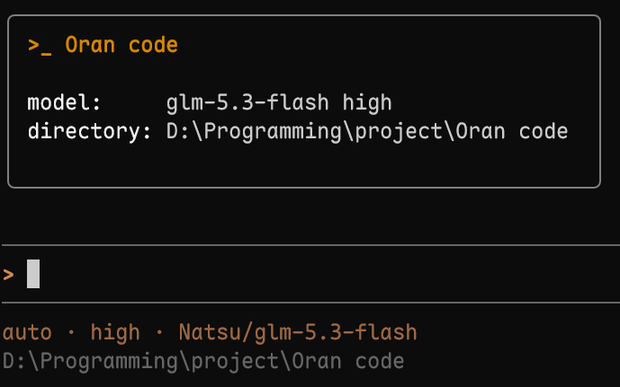

# Oran code

[English](README.md) | [简体中文](README.zh-CN.md)

A lightweight, terminal-native AI coding agent in TypeScript, built for fast iteration, safe autonomous editing, and background multi-tasking.

Oran code pairs an interactive React/Ink terminal UI with a flexible agent engine: inspect codebases, generate multi-step execution plans, edit files with instant rollback snapshots, delegate subtasks in the background, and connect to DeepSeek, Claude, GPT, Gemini, or local Ollama instances.



---

## Key Highlights

- **Terminal-Native TUI**: Real-time streaming thoughts, collapsible tool outputs, and fast keyboard overlays for commands (`/`), models (`/model`), and sessions (`/session`).
- **Safety & Instant Rollback**: Automatically snapshots file changes before execution. Revert recent edits at any time with `/undo`, or run exploratory tasks in temporary Git worktrees.
- **Background Subagents**: Offload slow searches, benchmarks, and multi-file explorations to concurrent background subagents without locking your interactive prompt.
- **Universal Model Support**: Connect directly to OpenAI, Anthropic Claude, DeepSeek (V3/R1), Google Gemini, Ollama, or any custom OpenAI-compatible endpoint.
- **Extensible & Context-Aware**: Native Model Context Protocol (MCP) support, custom skills (`SKILL.md`), project guidelines (`AGENTS.md`), automated context compaction, and Markdown-based project memory.

---

## Quickstart

### Prerequisites

- Node.js >= 22.5
- pnpm >= 10.0

### Setup

```bash
git clone https://github.com/baiyi115/Oran-code.git
cd "Oran-code"
pnpm install
```

### Running Oran

```bash
# Start in development mode
pnpm dev

# Or build and run
pnpm build
pnpm start
```

On first launch, type `/connect` to add a model provider and API key interactively. Re-run `/connect` any time to manage providers (edit settings or refresh their model lists).

To use the standalone `oran` command, link the built CLI once:

```bash
pnpm build
cd packages/oran-code
npm link
```

---

## Usage & CLI Commands

```bash
# Interactive TUI session (default)
oran

# Run a single task non-interactively
oran run "Fix the type error in src/index.ts"

# Choose a specific model or workspace
oran --model deepseek/deepseek-v4-flash --workspace ./my-project

# Inspect active workspace tools and permissions
oran inspect

# Review past task execution traces
oran tasks
```

### Keyboard Shortcuts

| Key                          | Action                                           |
| :--------------------------- | :----------------------------------------------- |
| `Enter`                      | Submit prompt or confirm selection               |
| `Shift + Enter` / `Ctrl + J` | Multi-line input (newline)                       |
| `Up` / `Down`                | Browse input history or navigate overlay options |
| `Tab`                        | Autocomplete slash commands and `@file` paths    |
| `Esc`                        | Close active overlay / cancel focus              |
| `Ctrl + C`                   | Cancel current generation or exit                |

### Essential Slash Commands

| Command         | Description                                                  |
| :-------------- | :----------------------------------------------------------- |
| `/connect`      | Manage model providers: list, add, edit, or remove them      |
| `/model`        | Open model picker overlay to switch active model             |
| `/plan`         | Switch to read-only Plan mode for safe workspace exploration |
| `/undo`         | Immediately revert the most recent batch of file changes     |
| `/session [id]` | Switch between active sessions or resume past sessions       |
| `/new`          | Start a clean conversation session                           |
| `/status`       | View token usage, active permissions, and MCP connections    |
| `/tasks`        | List background subagent tasks (alias `/subagents`)          |
| `/compact`      | Trigger manual context compaction to save tokens             |
| `/clear`        | Clear terminal transcript output                             |
| `/exit`         | Exit session                                                 |

---

## Configuration

Oran code stores global settings in `~/.oran/` and workspace-specific state in `.oran/`:

### Global Config (`~/.oran/config.json`)

The easiest way to write this file is the `/connect` command — it generates the entries below for you. Providers are keyed by name; each has connection `options` and a map of models:

```json
{
  "providers": {
    "deepseek": {
      "options": {
        "baseURL": "https://api.deepseek.com/v1",
        "protocol": "openai",
        "apiKey": "sk-..."
      },
      "models": {
        "deepseek-v4-flash": { "options": { "reasoningEffort": "high", "context_window": 128000 } }
      }
    }
  },
  "agent": { "lastModel": "deepseek/deepseek-v4-flash" }
}
```

- `protocol` is `"openai"` (OpenAI-compatible Chat Completions) or `"anthropic"` (Anthropic Messages). Endpoints that reject the `reasoning_effort` parameter are handled automatically: Oran retries without it once and remembers per model via `disableReasoningEffort`.
- `agent.lastModel` remembers the model picked via `/model` or `/connect`; pass `--model provider/model` to override it for one run.

### Workspace Structure (`.oran/` & `AGENTS.md`)

- `AGENTS.md`: Project-specific engineering standards, rules, and constraints automatically injected into the agent's system prompt.
- `.oran/snapshots/`: Local workspace snapshots for `/undo` rollback support.
- `.oran/sessions/`: Persisted session history and logs.
- `~/.oran/memory/<workspace-hash>/`: Markdown notes curated by the agent for long-term project knowledge (stored next to sessions and traces, outside the workspace).
- `.oran/skills/`: Project-local custom skills (`SKILL.md`).

### Custom Subagents (`agents/*.md`)

Subagents are Markdown files with YAML frontmatter; the body below the frontmatter is the subagent's prompt. Three built-in roles ship by default: `general` (bounded implementation tasks), `plan` (read-only planning), and `explore` (read-only exploration). Add your own at:

- `~/.oran/agents/*.md`: available in every workspace.
- `.oran/agents/*.md`: project-specific, overrides a user-level definition of the same name.

```markdown
---
name: reviewer
description: Review recent changes for correctness and style.
allowedTools: [list_files, read_file, glob_files, search_code]
permissionMode: plan
---

You are a code review subagent. Inspect recent changes and report concrete findings.
```

Supported frontmatter keys: `name`, `description`, `allowedTools`, `deniedTools`, `model` (provider/model override), `maxSteps`, `permissionMode`, `forceBackground`, and `isolation` (`shared-workspace` or `worktree` for a disposable Git worktree).

---

## Development & Verification

```bash
# Typecheck
pnpm typecheck

# Run unit tests
pnpm test

# Build production bundle
pnpm build
```

## License

Apache-2.0
